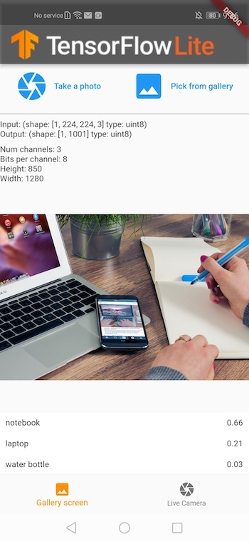

# Image classification MobileNet

This project is a sample of how to perform Image Classification using
TensorFlow Lite in Flutter. It includes support for both still images and live
camera streams.

## Download model and labels

To build the project, you must first download the MobileNet TensorFlow Lite
model and its corresponding labels. You can do this by
running `sh ./scripts/download_model.sh` from the root folder of the repository.

## About the sample

- You can use Flutter-supported IDEs such as Android Studio or Visual Studio.
  This project has been tested on Android Studio Flamingo.
- Before building, ensure that you have downloaded the model and the labels by
  following a set of instructions.
- All heavy operations are performed in a separate background isolate.
- This sample supports for still images and live camera streams. You can
  switch between these modes using the bottom bar.

#### Still image mode

You have the option to either select an image from your device or capture a new
photo to classify.

#### Live stream mode

The app will classify a continuous stream of image frames captured by the
camera.

